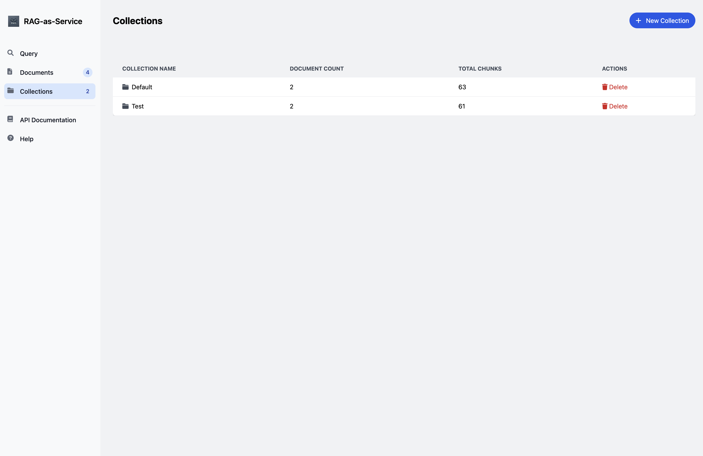

# RAG-as-Service

A robust Retrieval-Augmented Generation (RAG) service designed as a building block for LLM-powered applications. This service processes documents and provides semantic search capabilities through vector embeddings, enabling context-aware AI applications.

## 🎯 Purpose

RAG-as-Service serves as a crucial component in modern LLM applications by:
- Processing and storing documents with semantic understanding
- Providing fast and accurate context retrieval for LLM prompts
- Enabling hybrid search combining both semantic similarity and full-text search
- Managing document collections for organized knowledge bases

Perfect for building:
- Question-answering systems
- Document analysis tools
- Knowledge management systems
- AI-powered search applications

## 📸 Screenshots

### API Documentation

Complete API documentation with interactive Swagger UI

### Collections Management

Organize documents into collections for better context management

### Document Management

Upload and manage documents with automatic chunking and embedding

### Semantic Search

Powerful hybrid search combining vector similarity and full-text search

## 🚀 Features

- **Privacy-First Design**: Built to work with local LLMs through Ollama for complete data privacy
- **Flexible Embedding Options**: 
  - Primary: Local embeddings via Ollama (recommended)
  - Backup: OpenAI embeddings support (optional, requires API key)
- **Document Processing**: Upload and process PDF, TXT, and MD files with automatic chunking
- **Text Content Upload**: Direct text content upload via API endpoint
- **Multiple Embedding Providers**: Support for both Ollama and OpenAI embeddings
- **Vector Search**: Efficient semantic search using pgvector
- **Collections Support**: Organize documents into collections for better management
- **Robust Error Handling**: Comprehensive error handling and logging
- **Docker Support**: Full containerization with health checks
- **API Documentation**: Auto-generated API documentation with FastAPI

## 🏗️ Architecture

### Components

- **FastAPI Application**: Main web service handling requests
- **PostgreSQL with pgvector**: Vector database for document embeddings
- **Ollama/OpenAI**: Embedding generation services
- **Docker**: Containerization and orchestration

### Directory Structure

```
.
├── app/
│   ├── api/         # API endpoints
│   ├── core/        # Core functionality
│   ├── db/          # Database models and sessions
│   ├── models/      # Pydantic models
│   ├── schemas/     # API schemas
│   └── services/    # Business logic
├── tests/           # Test suite
├── .github/         # GitHub Actions
├── logs/            # Application logs
└── docker/          # Docker configurations
```

## 🛠️ Setup

### Prerequisites

- Docker and Docker Compose
- Python 3.11+
- Make (optional, for using Makefile commands)

### Quick Start

1. Clone the repository:
```bash
git clone https://github.com/sistemica/rag-as-service.git
cd rag-as-service
```

2. Set up environment:
```bash
cp .env.example .env
# Edit .env with your configuration
```

3. Start the service:
```bash
make run
```

The service will be available at http://localhost:8000

### Development Setup

1. Create virtual environment:
```bash
make dev-setup
```

2. Run tests:
```bash
make test
```

3. Run linters:
```bash
make lint
```

## 🔧 Configuration

### Environment Variables

| Variable | Description | Default |
|----------|-------------|----------|
| EMBEDDING_PROVIDER | Choose 'ollama' or 'openai' | ollama |
| EMBEDDING_MODEL | Model name for embeddings | nomic-embed-text |
| EMBEDDING_DIMENSION | Vector dimension | 768 |
| POSTGRES_USER | Database user | raguser |
| POSTGRES_PASSWORD | Database password | ragpass |
| POSTGRES_DB | Database name | ragdb |
| OLLAMA_BASE_URL | Ollama API URL | http://ollama:11434 |
| OPENAI_API_KEY | OpenAI API key | None |
| LOG_LEVEL | Logging level | INFO |

## 📚 API Documentation

After starting the service, visit:
- Swagger UI: Available both at http://localhost:8000/docs and embedded in the web interface
- ReDoc: http://localhost:8000/redoc

### Key Endpoints

#### Upload Document
```http
# Upload file
POST /documents/upload
Header: Collection-Name: <collection_name>
Body: form-data
  - file: PDF, TXT, or MD file

# Upload text content
POST /documents/upload/text
Header: Collection-Name: <collection_name>
Header: Document-Name: <document_name>
Content-Type: text/plain
Body: Your text content here

# Example using curl:
curl -X POST "http://localhost:8000/api/documents/upload/text" \
  -H "Content-Type: text/plain" \
  -H "Collection-Name: Default" \
  -H "Document-Name: example.txt" \
  -d "This is the text content to upload"
```

#### Search Documents
```http
POST /api/query
Content-Type: application/json

{
    "query": "your search query",
    "collections": "collection1,collection2",  // Optional, defaults to "Default"
    "limit": 10                               // Optional, range: 5-20, default: 10
}

Response:
[
    {
        "chunk_content": "Matching text content...",
        "document_filename": "example.pdf",
        "collection_name": "collection1",
        "distance": 0.123,
        "chunk_number": 1
    }
    // ... more results
]
```

## 🚗 Deployment

### Using Docker Compose

```bash
docker-compose up -d
```

### Using GitHub Container Registry

```bash
docker pull ghcr.io/sistemica/rag-as-service:latest
```

## 🧪 Testing & Quality Assurance

### Running Tests
```bash
# Run tests in Docker environment
make test

# Run tests with coverage report
make coverage

# Run tests locally in virtual environment
make test-local
```

### Code Quality
```bash
# Run all linters in Docker
make lint

# Format code
make format

# Run locally in virtual environment
make lint-local
make format-local
```

The project uses:
- pytest for testing
- black for code formatting
- isort for import sorting
- flake8 for code style checking

## 📈 Monitoring

The service includes:
- Health check endpoints
- Structured logging
- Docker health checks
- Basic metrics endpoint

## 🛡️ Security

- Non-root Docker user
- Environment variable configuration
- User isolation
- Input validation
- Error handling

## 🤝 Contributing

1. Fork the repository
2. Create a feature branch
3. Commit your changes
4. Push to the branch
5. Create a Pull Request

## 📝 License

This project is licensed under the MIT License - see the LICENSE file for details.

## 🙏 Acknowledgments

- FastAPI framework
- pgvector extension
- Ollama project
- OpenAI

## ⚠️ Common Issues

### Known Issues

1. Large PDF files might need increased timeout settings
2. Embedding service availability affects upload speed
3. Database indexing needed for large document collections

### Troubleshooting

1. Check logs: `make logs`
2. Verify health endpoints
3. Ensure database connectivity
4. Check embedding service availability

## 📞 Support

- Create an issue in the GitHub repository
- Check existing issues for solutions
- Review the documentation

## 🗺️ Roadmap

- [ ] Batch processing for large documents
- [ ] Additional embedding providers
- [ ] Enhanced search capabilities
- [ ] User authentication
- [ ] Document sharing features
